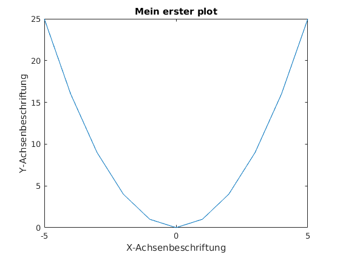
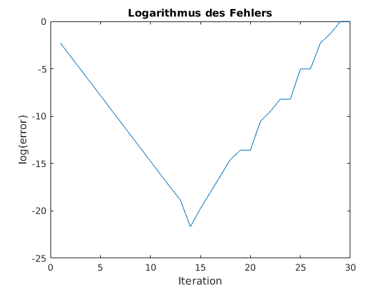

---
redirect_from:
  - "/00-einleitung/matlab-einfuehrung"
interact_link: lab/treecontent/00_einleitung/Matlab_Einfuehrung.ipynb
kernel_name: octave
title: 'Erste Schritte in Matlab'
prev_page:
  url: /emptypage
  title: 'Verwendung dieses Online Übungsbuches'
next_page:
  url: /emptypage
  title: 'Tragwerke - Ein Einführendes Beispiel'
comment: "***PROGRAMMATICALLY GENERATED, DO NOT EDIT. SEE ORIGINAL FILES IN /content***"
---

# Erste Schritte in Matlab

[Matlab](https://de.wikipedia.org/wiki/Matlab) ist eine interpretierte Skriptsprache, die insbesondere für numerische Berechnungen, Modellbildung und Simulation verwendet wird. Interpretierte Skriptsprachen zeichnen sich dadurch aus, dass sie von speziellen Computerprogrammen, sogenannten *Interpreter*, direkt interpretiert und ausgeführt werden. Im Kontrast dazu stehen Sprachen wie C/C++, die zunächst von einem Compiler in eine maschinenlesbare Datei übersetzt werden müssen.


Die Sprache wird von [The Mathworks Inc.](https://de.wikipedia.org/wiki/The_MathWorks) entwickelt. Dieses Unternehmen vertreibt kommerziell die gleichnamige Entwicklungsumgebung und den gleichnamigen Interpreter.

## Matlab Alternativen

Matlab ist nicht kostengünstig. Es gibt aber frei verfügbare Alternative. Zum Beispiel gibt es die kostenfreien Matlab-Klone [Octave](http://www.octave.org) oder [Scilab](http://www.scilab.org). Octave- bzw. Scilab-Skripte sind weitestgehend mit Matlab kompatibel. An einigen Stellen dieses Online-Lehrbuchs tauchen Textboxen mit Matlab-Code auf, der sich interaktiv ausführen lässt. Die Umsetzung basiert auf einen Octave-Kern, der im Hintergrund auf einer virtuellen Maschine läuft. [Hier](https://en.wikibooks.org/wiki/MATLAB_Programming/Differences_between_Octave_and_MATLAB) finden Sie eine Liste syntaktischer Unterschiede zwischen Octave und Matlab.

Neben Octave und Matlab gibt es eine Vielzahl weiterer Skriptsprachen, die man ebenso verwenden könnte, die drei am weitesten verbreiteten Sprachen aus dem Bereich wissenschaftlichen Rechnen sind wahrscheinlich 
 * [Python](https://www.python.org/) - Extrem vielseitige und weitverbreitete Sprache, [jeder sollte irgendwann mal Python lernen](https://hackernoon.com/10-reasons-to-learn-python-in-2018-f473dc35e2ee).
 * [R](https://www.r-project.org/) - Insbesondere für statistische Anwendungen geeignet
 * [Julia]() - Best of R and Matlab, streng genommen keine interpretierte Sprache, es kommt ein sogenannter *Just-In-Time-Compiler* zum Einsatz und wirbt mit höherer Performanz.
 

Warum soll ich also das kostenpflichtige Matlab verwenden, wenn es soviel kostenfreie Alternativen gibt? Zugegeben, viele Argumente fallen mir nicht ein. Es gibt dennoch ein paar sehr gute Gründe Matlab zu benutzen: 
1. Es ist eine ausgereifte, vielseitige robuste und einfach zu erlernende Skriptsprache, mit der man in sehr kurzer Zeit komplexe Modelle erstellen kann.
2. Die Benutzerumgebung liefert viele praktische Werkzeuge wie Profiler oder Debugging Tools.
2. Studenten erhalten in der Regel kostenfrei Zugang zu einer Campuslizenz.

## Installation

Es gibt verschiedene Wege mit Matlab zu arbeiten.

 * **Computerraum**: Am Fachbereich 3 der Hochschule Bonn-Rhein-Sieg sind auf allen Computern der Räume B107 und B114 Matlab installiert.
 * **Installation des Software-Pakets**: Das ist mit Sicherheit der sinnvollste Weg, wenn man viel mit Matlab arbeitet. Für Studenten der Hochschule Bonn-Rhein-Sieg wird [hier](https://www.h-brs.de/de/emt/matlab) beschrieben, wie man Matlab installiert und über die Campuslizenz aktiviert.
 * **Matlab Online**: Inzwischen gibt es eine [browser-basierte Version von Matlab](https://matlab.mathworks.com/), die ohne Installation funktioniert. Hierfür muss man sich nur über sein MathWorks Account einloggen und dort eine valide Lizenz hinterlegt haben.
 * **Matlab Mobile**: Es gibt eine [App von MathWorks](https://play.google.com/store/apps/details?id=com.mathworks.matlabmobile&hl=de), die sich anfühlt wie Matlab. Kommandos werden übers Internet zu einem Server geschickt, dort ausgeführt und das Ergebnis wird auf dem Smartphone angezeigt.

 
# Basics

In diesem Lehrbuch geht es hauptsächlich um Methodik, und weniger um die Computersprache in der die Algorithmen umgesetzt werden. Es ist also nicht Ziel, das drölfmillionste Tutorial für Matlab zur Verfügung zu stellen. Hierfür gibt es bereits viele sehr gute Anlaufstellen:

* [https://matlabacademy.mathworks.com/](https://matlabacademy.mathworks.com/)
* [http://www.mathworks.com/videos/](http://www.mathworks.com/videos/)
* [http://www.mathworks.de/academia/student_center/tutorials](http://www.mathworks.de/academia/student_center/tutorials)
* [http://www.mathworks.com/academia/courseware](http://www.mathworks.com/academia/courseware)
* [http://www.mathworks.de/matlabcentral/fileexchange/](http://www.mathworks.de/matlabcentral/fileexchange/)
* [let me google that for you...](http://lmgtfy.com/?q=matlab+tutorial+beginner)


Genauso hilft immer ein Blick in die Dokumentation. Nichtsdestotrotz sollen hier die absoluten Basics einmal beschrieben werden. Die wichtigsten Fenster von Matlab werden am Anfang das *Command Window*, der *Editor* und der *Workspace* sein. 


## Einfache Befehle

Im *Command Window* gibt man, wie der Name schon sagt, Befehle ein. Diese werden unmittelbar nach dem *Prompt* ```>>``` eingetippt. Gibt man zum Beispiel ```a=5``` ein, erscheint ein feedback, dass die Variable ```a``` erstellt wurde, und sie den Wert ```5``` zugewiesen bekommen hat.


{:.input_area}
```matlab
a=5
```


{:.output .output_stream}
```
a =  5

```

MATLAB gibt nach Eingabe eines Kommandos immer eine Rückmeldung, in diesem Fall wird die Variable noch einmal ausgegeben. Diese Rückmeldung kann mit Hilfe des Semikolons unterdrückt werden:


{:.input_area}
```matlab
b=2*pi;
```


Beide Variablen sind nun im Workspace hinterlegt, und können für weitere Berechnungen benutzt werden. Ich kann mir zum Beispiel den Wert von ```b``` ausgeben lassen,


{:.input_area}
```matlab
b
```


{:.output .output_stream}
```
b =  6.2832

```

oder einfache Rechenoperationen ausführen:


{:.input_area}
```matlab
b/a + i*sin(pi/8)
```


{:.output .output_stream}
```
ans =  1.25664 + 0.38268i

```

Das Ergebnis der Rechnung wird unter dem Variablennamen ```ans``` im Workspace hinterlegt. Ich kann dem Ergebnis explizit einen Variablennamen, hier ```c``` zuordnen:


{:.input_area}
```matlab
c = b/a + i*sin(pi/8)
```


{:.output .output_stream}
```
c =  1.25664 + 0.38268i

```

Wenn ich möchte, kann ich die Ausgabe des Ergebnisses unterdrücken, indem ich die Zeile mit einem Semikolon beende:


{:.input_area}
```matlab
d = exp(b/a - i*sin(pi/8));
```


Einige wichtige Punkte lassen sich hieraus schon erkennen:

* Variablenzuweisungen passieren von links nach rechts: Was rechts vom Gleichheitszeichen steht, wird der Variablen die links vom Gleichheitszeichen steht zugeordnet. Wenn es diese Variable nicht gibt, wird sie im Workspace hinterlegt.
* Alle Variablen werden im Workspace hinterlegt und können anschließend für weitere Berechnungen verwendent werden.
* In Matlab werden die skalaren Datentypen (```integer```, ```double```, ```float```, ...) nicht explizit angegeben, wie man es von Sprachen wie C oder C++ vielleicht gewöhnt ist. Auch wenn die Variable ```a``` ganzzahlig ist, geht Matlab standardmäßig von ```double``` aus. Der Typ einer Variable lässt sich in Matlab durch die Funktion ```class()``` ausgeben lassen:


{:.input_area}
```matlab
class(a)
```


{:.output .output_stream}
```
ans = double

```

## Vektoren und Matrizen

Matlab ist ein Kofferwort aus **Mat**rix-**Lab**oratory. Der Name impliziert schon, dass es sich ideal dazu eignet mit Matrizen und Vektoren zu arbeiten. Dabei wird nicht zwischen den beiden unterschieden: Ein Zeilenvektor mit $n$ Einträgen ist einfach eine Matrix aus $\mathbb{R}^{1 \times n}$, während ein Spaltenvektor mit $n$ Einträgen eine Matrix aus $\mathbb{R}^{n \times 1}$ ist.

In Matlab werden Matrizen mit eckigen Klammern geschrieben, ein Semikolon beendet eine Zeile:


{:.input_area}
```matlab
e=[1 2 3 4 5] % ein Zeilenvektor
f=[1;2;3;4;5] % ein Spaltenvektor
```


{:.output .output_stream}
```
e =

   1   2   3   4   5

f =

   1
   2
   3
   4
   5


```

Beim Produkt zweier Vektoren $\mathbf{e}$ und $\mathbf{f}$ (byw. Matrixprodukt zweier Matrizen) ist stets darauf zu achten, dass die Dimensionen zueinander passen! Kann ich die eben erstellten Vektoren $e$ und $f$ miteinander multiplizieren?


{:.input_area}
```matlab
e*f
```


{:.output .output_stream}
```
ans =  55

```

Aha, bei Multiplikation eines $(1,n)$-dimensionalen Vektors $\mathbf{e}$ mit einem $(n,1)$-dimensionalen Vektor $\mathbf{f}$ erhalte ich eine Zahl, bzw. eine $(1,1)$-dimensionale Matrix mit nur einem Eintrag. Wir erhalten das **Skalarprodukt**

$$ \mathbf{e} \cdot \mathbf{f} = \sum_{i=1}^n e_i \cdot f_i. $$


{:.input_area}
```matlab
f*e
```


{:.output .output_stream}
```
ans =

    1    2    3    4    5
    2    4    6    8   10
    3    6    9   12   15
    4    8   12   16   20
    5   10   15   20   25


```

Die Multiplikation eines $(n,1)$-dimensionalen Vektors $\mathbf{f}$ mit einem (1,n)-dimensionalen Vektor $\mathbf{e}$ liefert mit also eine $(n,n)$-dimensionale Matrix. Es handelt sich um das **diadische Produkt**

$$ A = \mathbf{f} \cdot \mathbf{e}, \hskip0.5cm A_{ij} = f_i \cdot e_j $$

Wie sieht es mit den folgenden Matrizen aus?


{:.input_area}
```matlab
g = [1; 1; 1];
h = [2; 2; 2];
g*h
```


{:.output .output_stream}
```
error: operator *: nonconformant arguments (op1 is 3x1, op2 is 3x1)

```

Nein! Es klappt nicht. Die Fehlermeldung gibt schon Auskunft darüber wieso, die Dimensionen der Matrizen passen nicht zusammen. 

*Hinweis:* Hier ist der Wortlaut der Octave-Fehlermeldung zusehen. Matlab gibt an dieser Stelle die folgende Fehlermeldung wieder:

```
Error using  * 
Incorrect dimensions for matrix multiplication. Check that the number of columns in
the first matrix matches the number of rows in the second matrix. To perform
elementwise multiplication, use '.*'.
```

Wir behelfen uns eines Tricks: Ein nachgestelltes Apostroph gibt die transponierte Matrix aus:


{:.input_area}
```matlab
size(g)
```


{:.output .output_stream}
```
ans =

   3   1


```


{:.input_area}
```matlab
g'
```


{:.output .output_stream}
```
ans =

   1   1   1


```


{:.input_area}
```matlab
size(g')
```


{:.output .output_stream}
```
ans =

   1   3


```

Das Skalarprodukt von $\mathbf{g}$ mit $\mathbf{h}$ können wir also doch ausrechnen:


{:.input_area}
```matlab
g'*h
```


{:.output .output_stream}
```
ans =  6

```

Sehr häufig ist es nützlich Operationen komponentenweise auszuführen. Nehmen wir zum Beispiel an, in einer kleinen Arbeitsgruppe arbeiten fünft Personen. Zwei Mitarbeiter haben Vollzeitstellen, d.h. 39.5 Stunden pro Woche, einer hat eine halbe Stelle und zwei studentische Hilfskräfte unterstützen jeweils mit acht Stunden pro Woche.. Die wöchentliche Arbeitszeit der Mitarbeiter hinterlegen wir in einem Vektor


{:.input_area}
```matlab
weekly_hours = [39.5, 19.5, 39.5, 8, 8];
```


Die stündlichen Bruttokosten der Mitarbeiterstellen in € schreiben wir ebenfalls in einen Vektor:


{:.input_area}
```matlab
costPerHour_brutto_euro = [57.5, 57.5, 40, 15, 15];
```


Wenn ich wissen möchte, wieviel die Mitarbeiter jeweils pro Woche kosten, muss ich die Vektoren komponentenweise miteinander multiplizieren. Das erreiche ich in Matlab, indem ich vor dem ```*```-Operator einen Punkt voranstelle, es ist also eine *punktweise* Operation, und keine Matrixmultiplikation:


{:.input_area}
```matlab
weekly_hours.*costPerHour_brutto_euro
```


{:.output .output_stream}
```
ans =

   2271.25   1121.25   1580.00    120.00    120.00


```

**Quiz:** Wie berechne ich die Gesamtkosten aller Mitarbeiter pro Woche mit nur einer Zeile in Matlab? *Hinweis: Das Ergebnis lautet 5212.5 €.*

Das Gleichungssytem $A\cdot \mathbf{x} = \mathbf{b}$ wird mit dem sogenannten **backslash**-Operator gelöst.


{:.input_area}
```matlab
A=[1,2,3;4,5,-6;7,8,9];
b=[0.1,0.2,0.3]';
x = A\b                     % x = inv(A)*b
```


{:.output .output_stream}
```

x =

   -0.0333
    0.0667
   -0.0000


```

To Do: Matrix concatenation, slicing. Unerschied function und Skript, auf scope eingehen und Beispiele bringen


{:.input_area}
```matlab
B=[A, b;b', 1];
```


{:.output .output_stream}
```
error: 'A' undefined near line 1 column 4

```

Das %-Zeichen läutet in MATLAB einen Kommentar ein.

* Wie in *ALLEN* Programmiersprachen gilt in MATLAB: ** Kommentieren Sie ihren Code! **


{:.input_area}
```matlab
eye(2);     % 2,2-Einheitsmatrix
ones(3,2);  % 3,2-Matrix gefuellt mit 1
zeros(2,4); % 2,4-Matrix gefuellt mit 0
rand(2);    % 2,2-Matrix mit Zufallszahlen von 0 bis 1
```


{:.output .output_stream}
```

ans =

     1     1
     1     1
     1     1


```

Wie in anderen Programmiersprachen können in MATLAB auch Schleifen verwendet werden. Die Syntax für eine for-Schleife ist


{:.input_area}
```matlab
for i=1:5
    f(i)=2^i;
end
```


Dabei wird der Vektor f automatisch in jedem Schleifendurchlauf um ein Element erweitert. Es ist zu beachten, dass in MATLAB auf das erste Element eines Vektors mit dem Index 1 zugegriffen wird. Weitere Schleifentypen sind in der Hilfe nachzulesen.

# Grafische Ausgabe


{:.input_area}
```matlab
x=linspace(-5,5,11);   % Ein Vektor mit Werten von -5 bis 5
y=x.^2;                % Ein Vektor y mit den zugehörigen Funktionswerten 

plot(x,y);             % Erstellen einer grafischen Darstellung
title('Mein erster plot')
xlabel('X-Achsenbeschriftung')
ylabel('Y-Achsenbeschriftung')
```


{:.output .output_stream}
```

x =

    -5    -4    -3    -2    -1     0     1     2     3     4     5


```


{:.output .output_png}



# Funktionen

* Funktionen werden normalerweise in einem eigenen m-file gespeichert, siehe das Handout zur Matlab Einführung.

* Kurze Funktionen (Einzeiler) können in Variablen, so genannten 'function handles' abgespeichert werden.


{:.input_area}
```matlab
% Die Unbekannten Größen einer function handle
% werden mit dem @-Symbol deklariert.
meineFunktion = @(x)  x.^2;

meineFunktion(2)
meineFunktion([2,3;4,5])
```


{:.output .output_stream}
```

ans =

     4


ans =

     4     9
    16    25


```

# Binominialkoeffizienten

siehe Handout


{:.input_area}
```matlab
%% fac.m
% calculate the factorial of an integer n
function z = fac(n)
    if n==0
        z=1;
    else
        z=n*fac(n-1);
    end
end
```


{:.input_area}
```matlab
n=5;
k=3;
fac(5)/(fac(k)*fac(n-k))
```


{:.output .output_stream}
```
ans =  10

```

# Programmierübung 2: Rundungsfehler

siehe Handout


{:.input_area}
```matlab
max_iter=30;            % Anzahl der Iterationen
z = zeros(max_iter,1);  % Initialisiere Vektor für z aus Effizienzgründen
err = zeros(max_iter,1);% Initialisiere Vektor für err aus Effizienzgründen

z(1)=2*sqrt(2);         %Anfangswerte
err(1)=abs(pi-z(1))/pi;

for n=1:max_iter-1
    z(n+1)=2^(n+1.5)*sqrt(1-sqrt(1-4^(-n-1)*z(n)^2));
    err(n+1)=abs(pi-z(n+1))/pi;
end
```


Logarithmische Darstellung des Fehlers


{:.input_area}
```matlab
plot(log(err))
title('Logarithmus des Fehlers')
xlabel('Iteration')
ylabel('log(error)')
```


{:.output .output_png}



